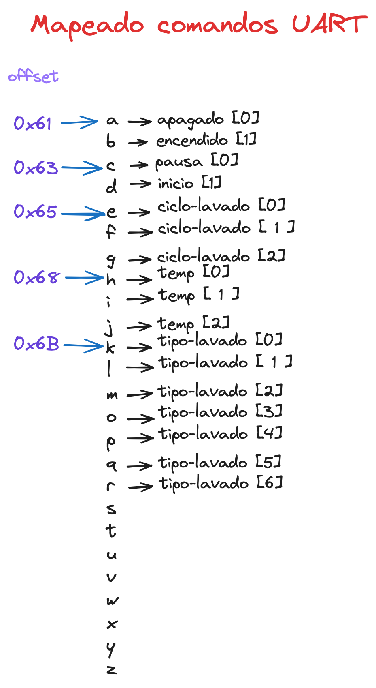

# UART Micropython

El proposito de este documento es el de documentar las conexiones utilizadas que fueron necesarias para lograr recibir los comandos del microcontrolador "master" 

# Cogigo que recibe comandos

Esta funcion es la encargada de inicializar el puerto UART con los pines seleccinados y el rate de bits a mandar, asi como el id de puerto segun el microcontrolador.
Esta funcion es llamada al inicio del programa.

```c
void inicio_uart() {
    uart_init(UART_ID, BAUD_RATE);
    gpio_set_function(UART_TX_PIN, GPIO_FUNC_UART);
    gpio_set_function(UART_RX_PIN, GPIO_FUNC_UART);
}
```
Una vez que se relice un cambio, se creo una funcion que se especializa en mandar el comando al puerto uart que espera ser leido.
Para esta funcion ya se tiene mapeado que significa cada comando y que offset necesita para cada funcion

```c
void send_cmd(int state, int offset) {
    cmd  = 0;
    uart_putc(UART_ID, cmd + offset);
}
```

## Mapeado comandos



# Conexiones

## Puerto UART
|   "Master"	|   "Slave"	|
|---	|---	|
|   GPIO-0    |     GPIO-1 	   |
|   GPIO-1    |     GPIO-0     |